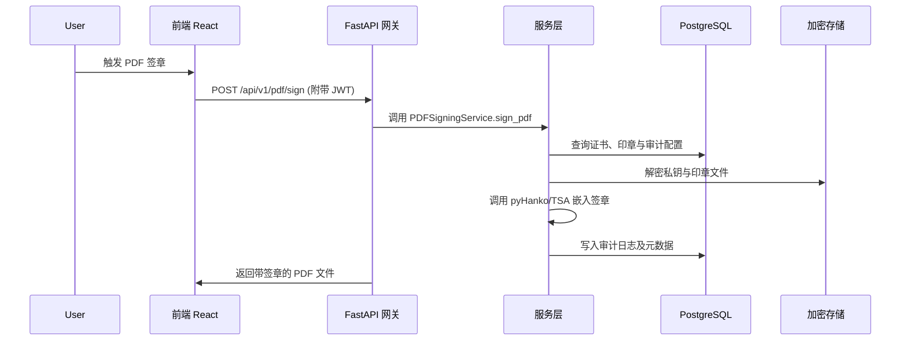
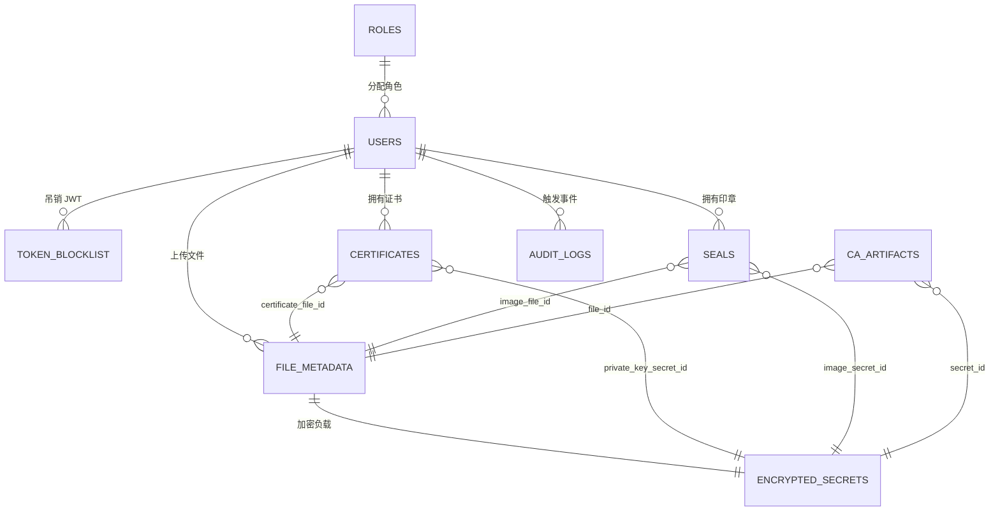

# ca-pdf 架构设计文档

## 1. 系统架构概览

### 1.1 总体架构图
```mermaid
flowchart LR
    User((终端用户))
    Browser[React 单页应用]
    Traefik[Traefik 反向代理]
    Frontend[前端容器\n(Nginx + Vite 构建产物)]
    FastAPI[FastAPI 应用层]
    ServiceLayer[服务层\n(CA / PDF / 加密存储)]
    DB[(PostgreSQL 数据库)]
    Secrets[(加密存储\nfile_metadata & encrypted_secrets)]
    TSA[TSA / OCSP 外部服务]
    Audit[(Audit Logs 表)]
    Monitoring[(集中日志 & 监控)]
    User --> Browser
    Browser <--> Traefik
    Traefik --> Frontend
    Browser -->|HTTPS / JSON API| Traefik --> FastAPI
    FastAPI --> ServiceLayer
    ServiceLayer --> DB
    ServiceLayer --> Secrets
    ServiceLayer --> TSA
    FastAPI --> Audit
    FastAPI --> Monitoring
    ServiceLayer --> Monitoring
```

ca-pdf 平台由 React 前端、FastAPI 后端与 PostgreSQL 数据层组成，通过 Traefik 统一暴露在 HTTPS 入口下。前端以 Vite 打包输出静态资源，由独立容器（Nginx）托管；用户的业务请求通过 Traefik 路由到 FastAPI 服务。FastAPI 内部采用分层架构：api 层负责协议转换、服务层承载核心业务逻辑、crud/model 层与数据库交互，同时通过 EncryptedStorageService 管理敏感文件与密钥。CA/PDF 相关服务会与外部 TSA/OCSP 服务交互，所有重要操作均落盘到 audit_logs 便于追踪。

### 1.2 三层架构说明
- **展示层（Presentation）**：React 单页应用承载所有用户交互逻辑，使用 React Router、Context 和自定义组件渲染控制台界面；请求通过 axios/httpClient 接入后端 JSON API，前端负责本地状态、Token 存储与可视化反馈。
- **业务层（Application/Service）**：FastAPI 中的 API Router、依赖注入体系与服务类（如 CertificateAuthorityService、PDFSigningService）组成中间层，完成参数校验、鉴权、业务编排、审计日志与错误处理，保持接口稳定。
- **数据层（Data）**：SQLAlchemy ORM 模型与 CRUD 仓储抽象负责 PostgreSQL 数据读写；EncryptedStorageService 以 Fernet 或 AES-GCM 算法对文件与私钥进行加密存储；审计日志、Token 黑名单等表支撑合规与安全需求。

### 1.3 组件交互流程


以签章为例：用户在前端选择证书与印章后，由 httpClient 注入 JWT 并调用后端；FastAPI 层完成权限验证与参数解析，随后将请求委托给 PDFSigningService。服务层读取数据库中证书、印章信息，解密加密存储的私钥/印章图片，使用 pyHanko 将签名嵌入 PDF，可选调用 TSA 获取时间戳；完成后写入审计日志，并以二进制流形式返回给前端。

## 2. 后端架构

### 2.1 整体结构
后端位于 `backend/app`，遵循清晰的模块划分：
```
backend/app
├── api/            # FastAPI 路由与依赖
│   ├── dependencies/
│   └── endpoints/
├── core/           # 配置、错误、加密等底层能力
├── crud/           # 数据访问封装 (SQLAlchemy 查询)
├── db/             # 数据库会话、初始化与迁移
├── models/         # ORM 模型定义
├── schemas/        # Pydantic 数据契约
└── services/       # 核心业务服务（CA、PDF、存储等）
```
- **API 层**：`api/endpoints` 组织 REST 路由，`api/dependencies` 提供鉴权、数据库 Session、速率限制等依赖。
- **业务逻辑层**：`services` 文件夹中的类实现业务编排，避免路由层出现大量逻辑。
- **数据访问层**：`crud` 模块对模型的创建、查询、更新进行封装，保持可测试性与单一职责。
- **工具层**：`core` 提供配置加载、密码哈希、错误类型与速率限制器、PDF 校验器等通用设施。

FastAPI 应用通过 `main.py` 构建，启动时执行 `init_db` 与 `bootstrap_admin` 确保初始 Schema 与管理员账号存在。

### 2.2 认证与授权
- **JWT Token 工作流程**：
  - **登录流程**：`POST /auth/login` 接收邮箱与密码，`user_crud.authenticate_user` 校验凭证并更新 `last_login_at`，`create_access_token` 与 `create_refresh_token` 会生成带有 `sub`（用户 ID）、`role`、`type`、`jti` 的签名 Token（默认 HS256）。
  - **Token 生成**：访问 Token 过期时间由 `ACCESS_TOKEN_EXPIRE_MINUTES` 控制（默认 15 分钟），刷新 Token 由 `REFRESH_TOKEN_EXPIRE_MINUTES` 控制（默认 3 天）。
  - **刷新机制**：`POST /auth/refresh` 校验 refresh token（确保 `type == "refresh"` 且未在黑名单），然后吊销旧 jti、重新生成 Access/Refresh Token，形成滑动过期。
  - **Token 吊销**：`token_blocklist` 存储所有已吊销的 Token；登出接口会同时吊销 refresh token 与当前 access token 的 jti。`get_current_user` 依赖会在每次请求时检查黑名单，确保被吊销的 Token 立即失效。
  - **速率限制**：`RateLimiter` 使用 asyncio + deque 实现窗口限流，对登录/刷新等敏感接口施加全局速率限制（默认 5 次/分钟），防止暴力破解。

- **RBAC 权限模型**：
  - 角色由 `roles` 表维护，当前内置 `admin` 与 `user`，`User.role` 通过外键约束到角色 Slug。
  - `require_roles` 依赖封装了角色校验逻辑，可组合在任意路由上；`ProtectedRoute` 前端组件与后端一致，保证端到端权限一致性。
  - 管理端接口（如用户管理、审计日志查询）均依赖 `require_roles(UserRole.ADMIN)`，普通用户仅能访问与自身相关资源。

### 2.3 核心服务模块
#### CertificateAuthorityService (~770 行)
- **职责**：托管内部私有 CA，包括根证书生成、用户证书签发/导入、吊销、CRL 生成与根材料加载。
- **算法支持**：根证书支持 RSA-4096 与 EC-P256，叶子证书支持 RSA-2048 与 EC-P256；通过枚举 `RootKeyAlgorithm` 与 `LeafKeyAlgorithm` 解耦算法策略。
- **密钥存储**：所有生成的 PEM、PKCS#12 包均通过 `EncryptedStorageService` 以 Fernet 或 AES-GCM 加密后存入 `file_metadata` / `encrypted_secrets`。
- **功能接口**：
  - `generate_root_ca`：生成自签根证书（带约束扩展），并在 `ca_artifacts` 中存档证书与私钥；生成后写入审计事件 `ca.root.created`。
  - `issue_certificate`：针对用户签发证书，支持自定义有效期、算法与 PKCS#12 密码，记录证书元数据与审计日志；返回 PEM + PKCS#12 二进制。
  - `import_certificate_from_p12`：允许导入由外部签发但受管理根 CA 签名的证书，包含 Serial 去重校验。
  - `revoke_certificate`：将证书状态标记为 revoked，并触发审计；与 `generate_crl` 配合生成 CRL。
  - `generate_crl`：读取全部 revoked 证书，构建 CRL 并存储于 `ca_artifacts`，支持配置 next_update；产出 CRL PEM 与吊销序列集合。
  - `load_certificate_bundle` / `export_root_certificate`：对外暴露已持久化的证书材料。
- **异常体系**：自定义 `CertificateAuthorityError` 子类对常见失败（重复生成、材料缺失、序列号冲突等）进行分类，便于 API 层转换统一错误码。

#### PDFSigningService (~445 行)
- **职责**：基于 pyHanko 完成 PDF 数字签章，支持可见/不可见签章、坐标定位、批量处理、TSA 时间戳、LTV 信息嵌入。
- **流程**：
  1. `_validate_pdf` 检查文件头、大小上限（`settings.pdf_max_bytes`）。
  2. `_load_certificate` 校验证书归属、状态、有效期，确保 signer 正常。
  3. `_load_seal_image`（可选）从加密存储读取印章图片，校验所有权与格式。
  4. `_create_signer` 将 PEM 证书/私钥转换为 pyHanko `SimpleSigner`，必要时构建证书注册表。
  5. `_apply_signature` 使用 pyHanko incremental writer 将签章写入，处理可见签章坐标、签章元数据（reason/location/contact）与 LTV 嵌入。
  6. 生成 `SigningResult`（包含 document_id、文件大小、是否使用 TSA、LTV）。
- **批处理**：`batch_sign_pdfs` 循环调用 `_apply_signature`，对每份文件捕获异常并返回成功/失败列表，保障批量操作不被单一失败阻断。
- **错误处理**：统一抛出 `PDFSigningError` 子类（证书不存在、状态异常、文件校验失败、签名生成异常等），上层可映射为标准错误响应。

#### PDFVerificationService (~260 行)
- **职责**：验证 PDF 内嵌签名的有效性、可信链、时间戳与修改级别。
- **实现**：
  - 使用 `PdfFileReader` 与 pyHanko `validate_pdf_signature` 对嵌入签名逐一检查，构造 `SignatureVerificationDetails` 响应。
  - 自动加载管理根 CA 作为 trust root；若未初始化根 CA，则抛出 `PDFVerificationRootCAError`。
  - 支持解析 signer common name、serial number、DocMDP 级别、时间戳状态，并处理 pyHanko 报错。
- **输出**：`PDFVerificationReport` 含总签名数、有效/可信数量及每个签名的详细诊断信息，用于前端展示。

#### EncryptedStorageService (~300 行)
- **职责**：以 Fernet 或 AES-GCM 对文件与私钥做加密存储，提供统一的读写接口。
- **特性**：
  - `store_private_key / store_certificate_pem / store_seal_image / store_encrypted_asset` 统一调用 `_store_binary`，生成 SHA-256 校验和并持久化至 `file_metadata` 与 `encrypted_secrets`。
  - 支持 PNG 签名校验、SVG UTF-8 校验等输入验证，防止伪造文件。
  - `load_private_key`、`load_certificate_pem`、`load_file_bytes` 提供解密读取能力，若密钥失效或负载损坏会抛出 `StorageCorruptionError`。
  - 审计：`store_seal_image` 支持写入 `audit_logs`（事件 `seal.uploaded`）。
  - 通过 `settings.storage_master_key_bytes()` 加载主密钥，支持从环境变量或文件读取。

### 2.4 数据库设计


- **roles**：主键 `slug`、唯一 `name`，描述系统角色，记录创建/更新时间。
- **users**：主键 `id`，索引 `email`/`username`；字段包含 `hashed_password`、`role`（引用 roles.slug）、`is_active`、`last_login_at`；逻辑删除通过 `is_active` 控制。
- **token_blocklist**：已吊销 Token 的 `jti`，带唯一索引，记录 `token_type`、`revoked_at` 与可选 `user_id`。
- **file_metadata**：所有文件的元数据（文件名、MIME、大小、checksum、owner_id），与 `encrypted_secrets` 建立一对一关系。
- **encrypted_secrets**：存储密文、算法、密钥版本、nonce/tag，引用 file_metadata.id；保证 `file_id` 唯一。
- **certificates**：存储证书核心字段（serial_number 唯一、subject_common_name、issued_at/expires_at、status），外键引用文件与私钥密文；索引 owner_id/status 以优化查询。
- **ca_artifacts**：记录根证书、CRL 等 CA 工件，关联文件与私钥密文。
- **seals**：印章基本信息及图像文件引用，`owner_id + name` 唯一，防止重复命名。
- **audit_logs**：审计日志表，记录 `event_type`、`resource`、`metadata`、`actor_id`、`ip_address`、`user_agent`，并对 `event_type`、`created_at` 建索引。

**索引策略**：访问频繁的字段（如用户邮箱、证书 serial/status、token jti、审计事件类型）均建立索引以提升查询性能。大部分外键采用 `SET NULL` 以保留审计痕迹。

**软删除设计**：项目通过状态字段替代物理删除——用户通过 `is_active`、证书通过 `status`（active/expired/revoked），印章可通过 `updated_at` 与业务逻辑标记弃用。保留历史数据确保审计可追溯。

### 2.5 异步处理
- **异步数据库访问**：全站采用 `AsyncSession`（SQLAlchemy + asyncpg）执行数据库操作，服务层使用 `await session.commit()/flush()`，配合 FastAPI 原生异步路由获得更高并发能力。
- **异步文件处理**：`EncryptedStorageService` 的读写在协程中执行，避免阻塞事件循环；批量签章时使用 `io.BytesIO` 与 pyHanko 的增量写入方式，减少磁盘 I/O。
- **异步 HTTP 请求（httpx）**：虽然生产代码主要与 pyHanko/TSA 交互，但在测试层大量使用 `httpx.AsyncClient` 模拟并发请求，确保 API 在异步上下文中正确运行。未来若需要访问 OCSP/外部服务，可直接以 httpx 集成，无需改写整体结构。

## 3. 前端架构

### 3.1 整体结构
```
frontend/src
├── App.tsx                # 顶层应用入口
├── App.test.tsx
├── components/            # 通用组件与主题
│   ├── ThemeProvider.tsx
│   ├── router/ProtectedRoute.tsx
│   └── ui/*.tsx
├── contexts/AuthContext.tsx
├── lib/                   # API 客户端与工具库
├── pages/                 # 页面级组件（登录、仪表盘等）
│   └── dashboard/*
├── routes/AppRoutes.tsx   # React Router 定义
├── styles.css             # 全局样式
├── theme.ts               # 设计令牌
└── types/                 # TypeScript 类型定义
```

应用以 React 18 + TypeScript 实现，使用 React Router v6 构建多级路由，`DashboardShell` 维护左侧导航与主题，`ProtectedRoute` 控制访问权限。Vite 负责开发/构建，`vitest` 在 `src/**` 下提供单测覆盖。

### 3.2 页面结构
- **页面层组织**：`pages` 文件夹下按职责划分子目录，`dashboard` 下包含 Overview、SigningWorkspace、Verification、UsersManagement、AuditLog 等。
- **共享组件**：`components/ui` 提供 Button/Card/Input/Modal 等基础交互组件；`components/signing`、`components/seals` 等目录封装业务组件，复用度高。
- **路由结构**：`AppRoutes` 由嵌套路由组成，`/` 默认展示 Overview，子路由 `/signing`、`/verification`、`/users` 等通过 `<Outlet />` 注入到 DashboardShell 的主区域。受保护路由会在进入前检查是否已登录及角色是否匹配。
- **权限保护**：`ProtectedRoute` 读取 `AuthContext` 的 `hasRole`，在加载期显示 Spinner，未登录跳转 `/login`，权限不足跳转 `/unauthorized`。

### 3.3 API 集成
- **API 客户端设计**：`lib/httpClient.ts` 基于 axios 创建实例，统一 `baseURL`、`Content-Type` 与跨域 Cookie 配置。`registerTokenProvider` 允许 AuthContext 挂载获取/刷新 Token 的回调。
- **请求/响应拦截**：请求拦截器自动注入 `Authorization: Bearer <token>`；响应拦截器在遇到 401 时串行执行刷新流程，避免多次并发刷新（`refreshPromise` 去重）。
- **认证头处理**：若刷新成功，将新 Access Token 写回原请求重试；若刷新失败，触发 `onUnauthorized`（前端自动清空状态并跳转登录）。
- **错误处理**：`lib/apiFetch.ts` 提供 fetch 封装，解析 JSON/文本响应并抛出 `ApiError` 包含状态码与返回体，方便在页面上统一提示。
- **领域 API 封装**：`lib/signingApi.ts`、`lib/caApi.ts`、`lib/usersApi.ts` 将各业务端点进一步封装为函数，处理 multipart/form-data、文件下载、批量签章结果转义等细节。

### 3.4 状态管理
- **本地状态**：组件内部通过 `useState` 管理表单输入、对话框显隐等微状态，避免全局污染。
- **全局状态**：`AuthContext` 持久化用户信息与 Token，通过 `localStorage` 保存 `AuthTokens`，在页面刷新后自动恢复；`useAuth` 暴露 `login/logout/refreshTokens/hasRole` 等接口供界面使用。
- **缓存策略**：登录成功后即刻将 Token/用户信息写入 `localStorage`，并在 Token 快过期时自动刷新。API 层对刷新流程做去重，避免重复请求。
- **PDF 预览与临时状态**：`lib/pdfjs.ts` 注入 worker 路径，页面在加载 PDF 时可先展示 Spinner，等待 Promise 结束再渲染。

### 3.5 样式系统
#### Tailwind CSS 使用
项目当前采用主题化的内联样式与设计令牌（`theme.ts`）实现统一的 spacing、颜色与排版，但组件风格遵循 Tailwind 的 utility-first 思路：在设计阶段与 Storybook 原型中使用 Tailwind 进行快速迭代，然后将结果映射到主题变量。未来如需引入 Tailwind Runtime，可直接在 Vite 配置中启用 PostCSS/Tailwind 插件，组件结构已预留 className 挂载点。

#### 主题支持
`ThemeProvider` 将 `theme.ts` 中的颜色、字体、阴影、圆角、间距等设计令牌注入上下文。组件通过 `useTheme` 读取值并应用内联样式，从而确保暗色/自定义主题扩展时只需调整令牌即可。设计令牌同时服务于图表、按钮、表格等场景，统一视觉语言。

#### 响应式设计
DashboardShell 使用 CSS Grid 构建双列布局，窄屏下可以通过媒体查询（在 styles.css/组件内联样式中）切换为单列布局。按钮、表单等组件通过 `theme.spacing` 动态调整留白，保证在移动端仍有足够可点击区域；文件上传、签章配置面板均采用自适应栅格，支持窗口缩放。若未来引入 Tailwind，可方便地使用断点类（如 `md:grid-cols-2`）进一步细化。

## 4. 数据流与工作流

### 4.1 认证流程
1. 用户在 Login 页面提交邮箱/密码，`AuthContext.login` 调用 `/auth/login`；若连续失败达到速率限制，将收到 429 错误。
2. 后端验证凭证后返回 Access/Refresh Token，前端将 Token 与用户信息写入内存与 localStorage。
3. 后续请求使用 axios 拦截器自动带上 Access Token；`get_current_user` 在每个后端端点校验 Token 与黑名单。
4. 当 Access Token 过期时，响应拦截器触发 `/auth/refresh`，后端验证 refresh token、吊销旧 jti 并签发新 Token。
5. 用户主动登出或 refresh 失效时，刷新失败触发 `onUnauthorized`，前端清理本地状态并跳转登录页面。

### 4.2 PDF 签章流程
1. 用户在 SigningWorkspace 上传 PDF，选择证书、印章并配置可见签章参数/TSA/LTV。
2. 前端构造 `FormData`，`signingApi.signPdf` 向 `/api/v1/pdf/sign` 发送 multipart 请求。
3. 后端验证文件大小/格式，校验证书与印章归属，加载密钥与印章图像。
4. PDFSigningService 使用 pyHanko 逐步写入签章，必要时通过 TSAClient 请求外部时间戳，完成后生成 LTV。
5. 生成的签章文件被写入审计日志（`pdf.sign` 类事件），并作为二进制响应流返回；前端根据响应头提取文件名与签章元数据。
6. 用户可立即下载已签章 PDF；若启用批量签章，前端解析结果数组，展示成功/失败明细。

### 4.3 证书管理流程
1. 管理员通过 CA 页面生成根 CA（一次性操作），系统在 `ca_artifacts` 持久化根证书与私钥。
2. 用户申请证书时，CertificateAuthorityService 使用根私钥签发叶子证书，并生成包含私钥的 PKCS#12 包，文件与私钥密文分别存储。
3. 用户可导出证书（PEM 或 P12）供本地安装；若证书泄露或失效，可调用吊销接口，状态变更为 revoked 并记录审计。
4. 需要导入外部证书时，`import_certificate_from_p12` 校验其链路与序列号后纳入管理。
5. 管理员定期执行 `generate_crl`，生成最新 CRL 下发到客户端，保证信任链可维护。

### 4.4 审计日志流程
1. 用户在系统内的操作（登录、签章、证书操作、印章上传等）均在相应 service 中调用 `audit_log_crud.create_audit_log` 产生事件。
2. 记录内容包含 `event_type`（如 `ca.certificate.issued`）、`resource`、`actor_id`、`metadata`、`IP`、`User-Agent` 等。
3. 所有事件存储在 `audit_logs` 表，按时间和事件类型建立索引，方便后台查询与导出。
4. 前端的 AuditLog 页面可以根据事件类型、时间范围筛选并展示日志，满足合规追溯要求。

## 5. 技术决策与权衡
- **FastAPI**：天然支持 async/await，性能优于传统同步框架；内置 OpenAPI 文档，结合 Pydantic 类型系统提供严格的输入校验；依赖注入模式简化测试与扩展。
- **React**：组件化开发模式适合构建交互复杂的操作台；与 React Router、TanStack Query 等生态兼容，方便后续扩展；大量开发者社区保证维护成本低。
- **SQLAlchemy**：ORM 既能提供类型安全（通过 `Mapped`）也支持复杂查询，多数据库兼容；与 Alembic 无缝衔接，迁移管理便利。
- **pyHanko**：开源且完整的 PDF 签章/验证生态，支持 TSA、LTV、OCSP，避免重复造轮子；API 层面可扩展（如自定义可见签章渲染）。
- **加密存储**：私钥及印章属于敏感资产，直接存储在数据库中配合 AES-GCM/Fernet 加密，避免明文落盘；通过统一服务封装，未来可平滑迁移至对象存储或 HSM。

## 6. 扩展性与性能

### 6.1 水平扩展
- **无状态设计**：FastAPI 层不保存会话状态，所有信息存储在 JWT/数据库中，可水平扩容多个应用副本挂载在 Traefik 后。
- **连接池调优**：`asyncpg` 与 SQLAlchemy Pool 提供连接池，每个实例可配置最小/最大连接，配合数据库连接数限制调整。
- **缓存层（Redis）预留**：虽然当前版本尚未接入 Redis，但服务层对缓存友好，可在用户/证书查询等热点路径增加缓存，提高读取性能。
- **负载均衡**：Traefik 可根据请求头将流量分配到多个 backend/ frontend 副本，支持 sticky session（若未来引入）与 HTTPS 证书自动续期。

### 6.2 垂直扩展
- **数据库优化**：通过合理索引、批量提交（如批量签章写审计日志时合并事务）减少锁竞争；监控慢查询并调整执行计划。
- **缓存策略**：对经常使用的配置（如根证书、CRL）可在服务层缓存于内存或 Redis，减少频繁 IO。
- **异步处理**：长耗时操作（批量签章、证书导出）均在异步协程中执行，不阻塞主线程；可结合后台任务队列进一步解耦。
- **资源限制**：通过 Docker 配置 CPU/内存限制；针对 pyHanko 签章时的 CPU 密集型操作，可以使用多进程或 Celery worker 分担。

### 6.3 性能指标
- **API 响应时间**：普通查询类接口目标小于 100ms，签章/证书生成类接口控制在 1~3 秒内（视文件大小）；批量签章需提供进度反馈。
- **数据库查询**：保持常规查询在 10ms 以内，复杂报表（审计日志）依赖索引优化；定期执行 EXPLAIN 分析。
- **前端加载时间**：Vite 构建的生产包控制在 200KB 左右（gzip 后），首屏加载时间目标 < 2s；按需拆分路由组件减少初始加载。

## 7. 安全架构

### 7.1 认证安全
- 使用强随机 `SECRET_KEY` 对 JWT 进行签名，默认 HS256，也可替换为 RS256。
- Access Token 短时有效，Refresh Token 适中有效期，配合刷新时旋转 jti，降低被窃取风险。
- Token 黑名单确保登出/吊销即时生效；RateLimiter 防止暴力破解。

### 7.2 数据安全
- 主密钥 `ENCRYPTED_STORAGE_MASTER_KEY` 通过环境变量或外部文件提供，可使用 KMS 保管。
- 私钥/印章等敏感数据全部加密存储在 `encrypted_secrets`，数据库即使泄露无明文。
- 审计日志完整记录操作信息，支持安全审查与合规审计。

### 7.3 通信安全
- Traefik 强制 HTTPS（redirect-to-https 中间件）；生产环境可通过 Let's Encrypt 自动签发证书。
- CORS 支持配置白名单，防止跨域滥用；`BACKEND_CORS_ORIGINS` 使用 JSON 列表，部署时锁定可信域。
- 可在 Traefik 配置速率限制、防火墙规则，抵御 DDoS。

### 7.4 输入验证
- FastAPI + Pydantic 在 API 层完成参数校验（类型、范围、格式）。
- 自定义验证器处理文件校验、算法选择等业务规则，避免服务层收到非法数据。
- 权限检查贯穿每个路由与服务调用，敏感操作必须验证角色与资源归属。

## 8. 错误处理与日志

### 8.1 错误分类
- **客户端错误 (4xx)**：参数缺失、认证失败、权限不足、资源不存在等；对应 `APIException` 子类，比如 `ValidationError`、`UnauthorizedError`。
- **服务器错误 (5xx)**：服务内部异常、外部服务不可用等；捕获后统一返回 `INTERNAL_ERROR`。
- **业务逻辑错误**：证书已吊销/已存在、签章失败等，通过专用异常类型抛出，并映射为可读错误码。

### 8.2 错误响应格式
```json
{
  "detail": "错误描述",
  "error_code": "ERROR_CODE",
  "timestamp": "2024-01-01T00:00:00Z"
}
```
实际实现使用 `ErrorResponse` Pydantic 模型，字段包含 `code`、`message`、`detail`、`timestamp`、`path`、`request_id`。`APIException` 处理器将 code、message 输出到前端，detail 仅在开发模式显示。

### 8.3 日志记录
- **级别**：使用标准 logging，DEBUG 供开发排查，INFO 记录关键节点（启动、健康检查），WARNING/ERROR 捕获异常。
- **结构化日志**：可配置 JSONFormatter 方便接入 ELK；`request_id` 用于串联请求链路。
- **审计日志**：与业务日志区分，持久化到数据库，保留安全证据。

## 9. 测试架构

### 9.1 后端测试
- **单元测试**：`backend/tests` 使用 pytest + pytest-asyncio，覆盖服务层逻辑（如证书签发、签章流程、错误分支）。
- **集成测试**：使用 `httpx.AsyncClient` 启动 FastAPI ASGI 应用，验证完整的请求-响应链路；SQLite 内存数据库用于隔离测试数据。
- **端点测试**：`tests/test_*_api.py` 覆盖认证、证书、印章、审计日志等 REST 接口，确保权限与验证正确。

### 9.2 前端测试
- **组件测试**：Vitest + Testing Library 模拟用户交互（例如 AuditLogPage、SigningWorkspacePage），验证 UI 状态与异步行为。
- **集成测试**：通过 Mock axios/httpClient，断言页面在模拟响应下的渲染与错误处理逻辑。

### 9.3 测试数据库
- 测试环境使用 SQLite（`sqlite+aiosqlite`），通过 Alembic 迁移保持 Schema 一致。
- `test_app.db` 提供预构建数据库供测试复用；每个测试用例后清理表，确保测试独立。

## 10. 部署架构
- **Docker 容器化**：`backend/Dockerfile` 与 `frontend/Dockerfile` 分别构建镜像，支持多阶段构建减少体积。
- **Docker Compose**：`docker-compose.yml` 编排 Traefik、PostgreSQL、后端、前端服务；通过 `internal`/`edge` 网络隔离内外部流量。
- **Traefik 反向代理**：负责证书自动签发、HTTP->HTTPS 重定向、健康检查；前端、后端路由基于域名区分。
- **环境配置**：`.env`、`.env.docker` 管理环境变量，包含数据库连接、密钥、域名配置。
- **卷挂载策略**：PostgreSQL 数据和 Traefik ACME 持久化到命名卷，确保容器重启数据不丢失。

## 11. 监控与可观测性
- **日志聚合**：Traefik、FastAPI、应用日志可发送至集中化平台（ELK/Graylog）；日志中包含 request_id、客户端信息，方便溯源。
- **性能监控**：可通过 Prometheus + Grafana 采集 Uvicorn/FastAPI 指标（请求耗时、并发数），数据库层可启用 `pg_stat_statements` 监控慢查询。
- **错误追踪（Sentry）**：建议在 FastAPI 中集成 `sentry-sdk`（通过中间件捕获未处理异常）；前端可使用 `@sentry/react` 捕获运行时错误，二者共享 release 版本号。
- **健康检查**：`/health` 路由返回服务状态与名称，Traefik/负载均衡器可基于此实现存活探针；还可以结合 Traefik 内置 `--ping`。

## 12. 文件存储策略
- **本地文件系统存储**：所有文件以加密形式存储在数据库（file_metadata + encrypted_secrets）中，避免额外文件系统依赖；若文件较大可改用对象存储驱动。
- **加密存储**：通过 Fernet（对称加密+HMAC）或 AES-GCM（带认证）保证机密性与完整性，主密钥从环境变量/文件加载，可定期轮换。
- **备份与恢复**：数据库备份即包含密文与元数据；恢复时需同时恢复主密钥（ENCRYPTED_STORAGE_MASTER_KEY），否则无法解密。
- **S3/OSS 扩展潜力**：EncryptedStorageService 的 `_store_binary` 可扩展为上传到 S3/OSS，再将元数据写入数据库；目前的 `storage_backend` 字段已为多后端支持预留占位。

---
本架构设计文档概述了 ca-pdf 平台的系统组件、服务分层、核心流程与运维策略，旨在帮助开发与运维团队快速理解现有实现并指导后续演进。